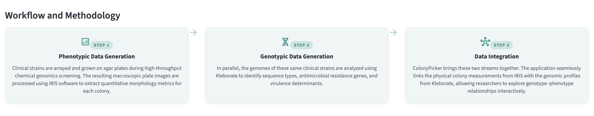
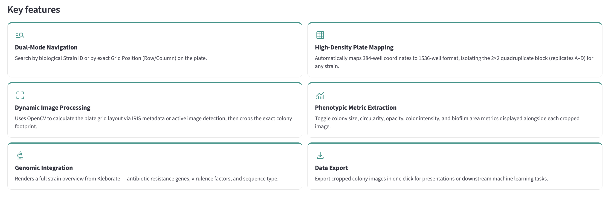

A genotype–phenotype browser for *Klebsiella pneumoniae* — linking macroscopic plate images with IRIS morphology measurements and Kleborate genomic data.

---

## Overview

ColonyPicker is an interactive Streamlit application developed to support high-throughput chemical genomics screening of *Klebsiella pneumoniae* clinical isolates. It bridges two independent data streams:

- **Phenotypic data** — colony morphology metrics extracted from high-density agar plate images using [IRIS](https://github.com/critichu/Iris)
- **Genomic data** — antimicrobial resistance genes, virulence loci, and sequence types identified by [Kleborate](https://github.com/klebgenomics/Kleborate)

Researchers can navigate 1536-well plates, inspect individual colony crops, and immediately view the corresponding genomic profile for any strain.

---

## Workflow and Methodology



---

## Features



---

## Project Structure

```text
ColonyPicker/
├── app/
│   ├── main.py                  # Entry point; sidebar navigation
│   ├── colony_picker.py         # Colony Viewer page
│   ├── strain_overview.py       # Genomic metadata panels
│   └── utils/
│       ├── data_loading.py      # CSV / Excel / IRIS file parsers
│       └── image_handling.py    # Plate image loading and colony extraction
├── config/
│   └── config.yaml              # File and directory paths
├── data/
│   ├── plate_images/            # *.JPG.grid.jpg plate images
│   ├── iris_measurements/       # *.iris measurement files
│   ├── strain_names.csv         # Strain ID → Row / Column / Plate mapping
│   └── kleborate_all.tsv        # Kleborate output (genomic metadata)
├── requirements.txt
└── README.md
```

---

## Data Format

### Plate images

Filename convention: `{Condition}-{Plate}-{Batch}_A.JPG.grid.jpg`

Example: `Ceftazidime-1ugml-1-1_A.JPG.grid.jpg`

### IRIS files

Filename convention: `{Condition}-{Plate}-{Batch}_A.JPG.iris`

Each file contains per-colony measurements and grid coordinates (top-left / bottom-right pixel positions).

### Strain map (`data/strain_names.csv`)

Must contain at minimum the columns `ID`, `Row`, `Column`, and `Plate`, mapping each strain identifier to its position on the 384-well source plate.

### Kleborate file (`data/kleborate_all.tsv`)

Standard Kleborate output TSV; matched to strains via the `strain` column.

---

## Configuration

Edit `config/config.yaml` to point to your data:

```yaml
files:
  strain_file: "data/strain_names.csv"
  kleborate_file: "data/kleborate_all.tsv"

directories:
  image_directory: "data/plate_images/"
  iris_directory:  "data/iris_measurements/"
```

---

## Installation

**Requirements:** Python 3.11+

```bash
git clone https://github.com/gzhoubioinf/ColonyPicker.git
cd ColonyPicker

# Create virtual environment
python3.11 -m venv venv
source venv/bin/activate          # macOS / Linux
# venv\Scripts\activate           # Windows

# Install dependencies
pip install -r requirements.txt
```

---

## Running the App

```bash
streamlit run app/main.py
```

The app opens in your browser at `http://localhost:8501`.

---

## Usage

1. Navigate to **Colony Viewer** in the left panel.
2. Choose a lookup method:
   - **Search by strain ID** — select a strain from the dropdown; its plate position is resolved automatically.
   - **Enter grid position** — enter a Row (1–32) and Column (1–48) directly.
3. Select a **Condition** (e.g. `Ceftazidime-1ugml`) and **Plate / Batch**.
4. Optionally adjust which **Metrics** to display.
5. Click **Analyse** to load the plate image, extract the four replicate colonies, and display the genomic profile.

---

## Available Metrics

| Metric | Description |
| --- | --- |
| Colony size | Total colony area in pixels |
| Circularity | Roundness (1 = perfect circle) |
| Opacity | Optical density proxy for colony density |
| Colony color intensity | Mean pixel intensity of the colony |
| Biofilm area size | Area covered by biofilm |
| Biofilm color intensity | Mean intensity within the biofilm region |
| Biofilm area ratio | Fraction of colony area covered by biofilm |
| Size normalized color intensity | Color intensity corrected for colony size |
| Mean sampled color intensity | Sampled mean intensity |
| Average pixel saturation | Mean HSV saturation across colony |
| Max 10% opacity | 90th-percentile opacity value |

---

## References

If you use ColonyPicker in your research, please cite our work:

- *(citation forthcoming)*

Please also cite the tools this application relies on:

- **High-Throughput Phenotypic Screening Pipeline:**
  Williams G., Ahmad H., Sutherland S., et al. (2025). High-throughput chemical genomic screening: a step-by-step workflow from plate to phenotype. *mSystems*, 10(12), e00885-25. DOI: [10.1128/msystems.00885-25](https://doi.org/10.1128/msystems.00885-25)

- **Kleborate (Genomic Profiling):**
  Lam, M. M. C., et al. (2021). A genomic surveillance framework and genotyping tool for *Klebsiella pneumoniae* and its related species complex. *Nature Communications*, 12(1), 4188. DOI: [10.1038/s41467-021-24448-3](https://doi.org/10.1038/s41467-021-24448-3)

- **IRIS (Phenotypic Image Analysis):**
  Kritikos, G., Banzhaf, M., Herrera-Dominguez, L., et al. (2017). A tool named Iris for versatile high-throughput phenotyping in microorganisms. *Nature Microbiology*, 2(5), 17014. DOI: [10.1038/nmicrobiol.2017.14](https://doi.org/10.1038/nmicrobiol.2017.14)

---

## Contact

ColonyPicker is a joint project developed by the
**[Infectious Disease Epidemiology Lab](https://ide.kaust.edu.sa/)** (KAUST)
and the **Banzhaf Lab** (Newcastle University).

| Name | Email |
| --- | --- |
| Ge Zhou | <ge.zhou@kaust.edu.sa> |
| Danesh Moradigaravand | <danesh.moradigaravand@kaust.edu.sa> |
| Manuel Banzhaf | <manuel.banzhaf@newcastle.ac.uk> |

---

## License

See [LICENSE](LICENSE).
